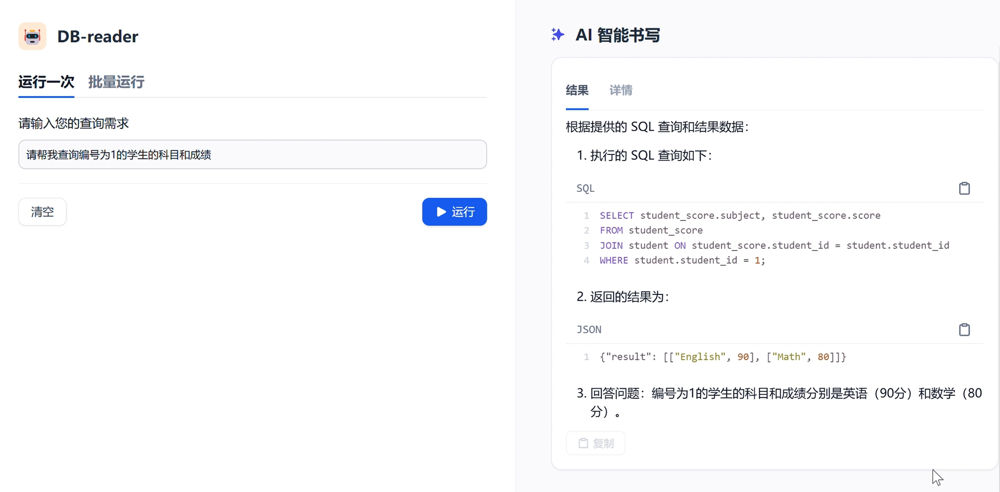

# 简介 
该项目依赖qwen大模型，使用dify组建workflow，实现智能生成SQL并返回结果。
我是在普通的笔记本(Intel Core i7-13700H + 16G Mem)上运行的，没有用到GPU。

- 使用技术：ollama + dify + docker + postgres + python flask
- 模型: qwen2-7b，只占用4-5G内存
- 输入: 自然语言一句话描述需求
- 输出: 你想要的答案
- 过程: 大模型生成SQL后，转发到数据库服务，再返回到大模型汇总结果
- 坑点: dify不能像db-gpt一样直连数据库，需要把数据库打包成http链接对外提供服务，我用的Flask框架

# 文件内容说明
- app.py 打包数据库接口，向外提供http服务
- DB-reader.yml 用于dify workflow的配置文件
- agent.py 用于dify workflow里的执行SQL模块需要的python代码
- 表名和表结构.txt PG数据库表结构，用于在dify workflow里组建知识库
- student_data.sql 用于准备PG数据库数据

# 步骤
- ollama run qwen2:7b 使能qwen大模型
- python app.py 提供数据库服务
- 导入dify工作流的yml，部署运行
- 填写运行一次

# 结果

参考视频：https://youtu.be/DYEzumbXeBw

# 致谢
- yihong0618 https://github.com/yihong0618
- 智奕AI https://www.bilibili.com/video/BV1Pmy6YuEow